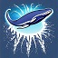

# Exploding Whale

Some coding style analyzers, based on the [coding style](https://github.com/SonarSource/sonar-dotnet/blob/master/docs/coding-style.md) of `sonar-dotnet`.

## Rules

- [x] EW001: Type name contains `Helper`
- [x] EW002: Local functions should be placed at the end of a method
- [x] EW003: Use 'is (not)' to compare with null.
- [x] EW004: Static methods should be placed after instance methods.
- [x] EW005: Instance fields should be placed after static fields.
- [x] EW006: Instance properties should be placed after static properties.
